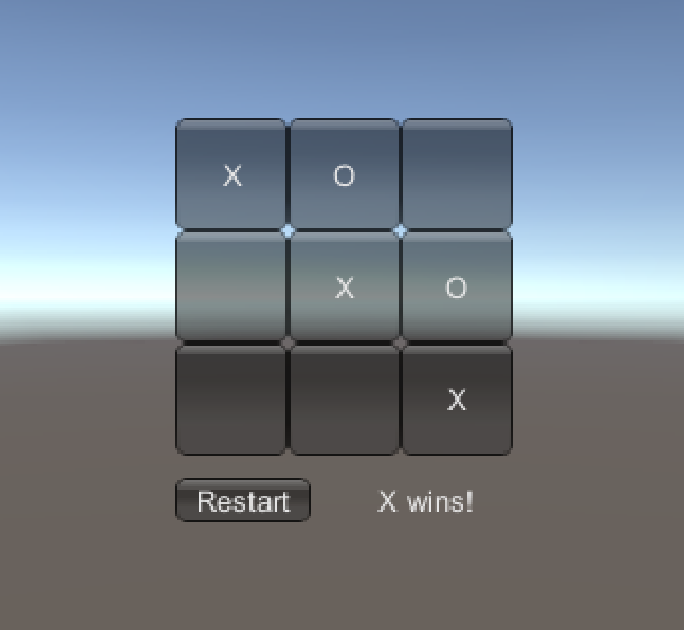
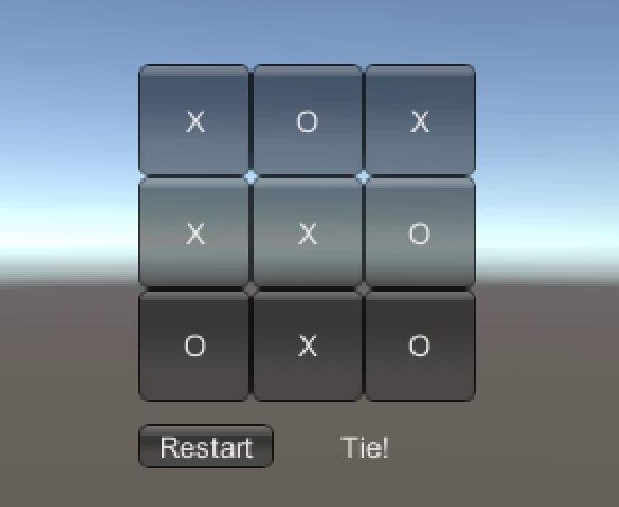

## TicTacToe 井字棋

### 演示视频

<a href="https://www.ixigua.com/i6736058652848816140/" target="_blank">视频链接</a>  
<a href="https://github.com/guojj33/Unity3DLearning/blob/master/HW2/assets/TicTacToe.mp4" target="_blank">(备用链接)</a>

### 环境
* Unity 5.5.0f3(64bit)
* win10

### 运行方法
1. 直接双击TicTacToe/Assets/scene.unity
2. 或者通过Unity3D查找到TicTacToe工程文件夹打开

### 游戏说明
* 游戏中会提示轮到哪一方
* 游戏可能达成平手或某一方获胜，此时需要点击Restart才能重新开始游戏

### 运行结果
* #### 一方获胜  

* #### 平手  
