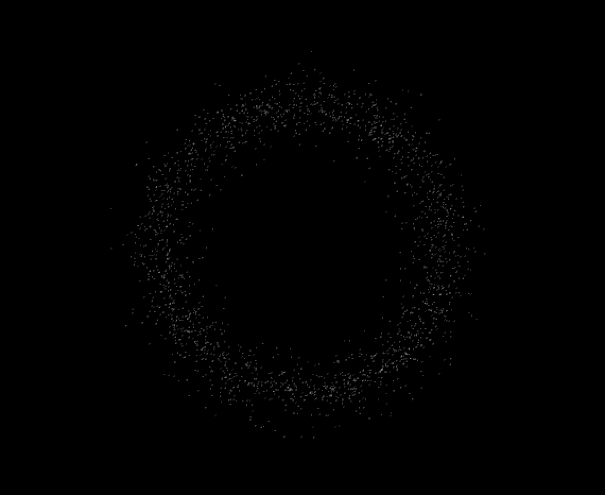
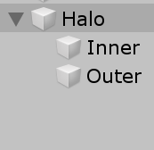
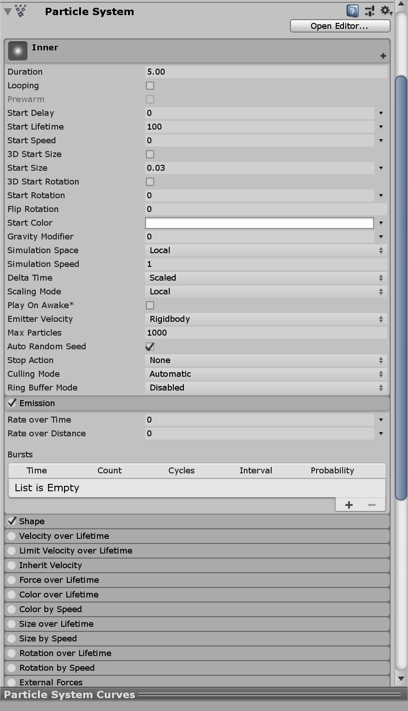

## 简单粒子光环 - Halo

### 文件说明

- 代码放在 [Halo/Assets/Scripts](https://github.com/guojj33/Unity3DLearning/tree/master/HW8/Halo/Assets/scripts) 中
- 工程下载到本地后，双击 Halo/Assets/1.unity 即可打开工程

### 制作过程

#### 结构分析  
- 粒子光环由内外两层粒子构成。外层粒子分布范围更广，旋转速度更快。内层粒子分布范围窄，旋转速度更慢。  

- 如图创建 3 个空对象  

- 给 Inner 和 Outer 添加 Particle System 组件，都做如图设置。  


#### 代码设计
- HaloParticle.cs  
    需要记录的粒子的数据有，粒子当前距离圆心的半径和角度  
    ```C#
    public class HaloParticle {
        public HaloParticle(float r = 0, float a = 0) {
            radius = r;
            angle = a;
        }
        public float radius {
            get;
            set;
        }
        public float angle {
            get;
            set;
        }
    }
    ```
- InnerHalo.cs  
    - 粒子系统初始化  
    赋予每一个粒子半径和角度值，确定粒子的位置  

        ```C#
        public ParticleSystem particleSystem;
        private ParticleSystem.Particle[] particleArray;
        private int haloResolution = 3500;
        private float minRadius = 2.5F;
        private float maxRadius = 4F;
        private HaloParticle[] haloParticle;
        // Start is called before the first frame update
        void Start()
        {
            particleSystem = this.GetComponent<ParticleSystem> ();
            particleArray = new ParticleSystem.Particle[haloResolution];
            haloParticle = new HaloParticle[haloResolution];
            particleSystem.Emit(haloResolution);
            particleSystem.GetParticles(particleArray);
            for(int i = 0; i < haloResolution; ++i){
                float shiftMinRadius = Random.Range(1, (maxRadius + minRadius) / 2 / minRadius);
                float shiftMaxRadius = Random.Range((maxRadius + minRadius) / 2 / maxRadius, 1);
                float radius = Random.Range(minRadius * shiftMinRadius, maxRadius * shiftMaxRadius);

                float angle = Random.Range(0, Mathf.PI * 2);

                haloParticle[i] = new HaloParticle(radius, angle);
                particleArray[i].position = new Vector3(radius * Mathf.Cos(angle), radius * Mathf.Sin(angle), 0);
            }
            particleSystem.SetParticles(particleArray, particleArray.Length);
        }
        ```
    - 粒子系统运作  
    更新粒子角度值，重新计算位置，实现旋转效果  
    
        ```C#
        void Update()
        {
            for(int i = 0; i < haloResolution; ++i){
            haloParticle[i].angle -= Random.Range(0, 1F/360) / 2;
            float angle = haloParticle[i].angle;
            float radius = haloParticle[i].radius;
            particleArray[i].position = new Vector3(radius * Mathf.Cos(angle), radius * Mathf.Sin(angle), 0);
            }
            particleSystem.SetParticles(particleArray, particleArray.Length);
        }
        ```
- OuterHalo.cs
外层的代码和内层基本相同，只需修改几个参数，修改粒子数目，半径范围和旋转速度即可。