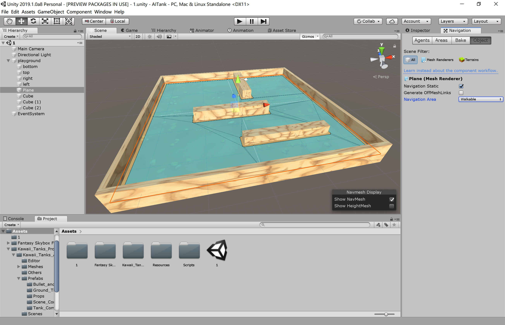
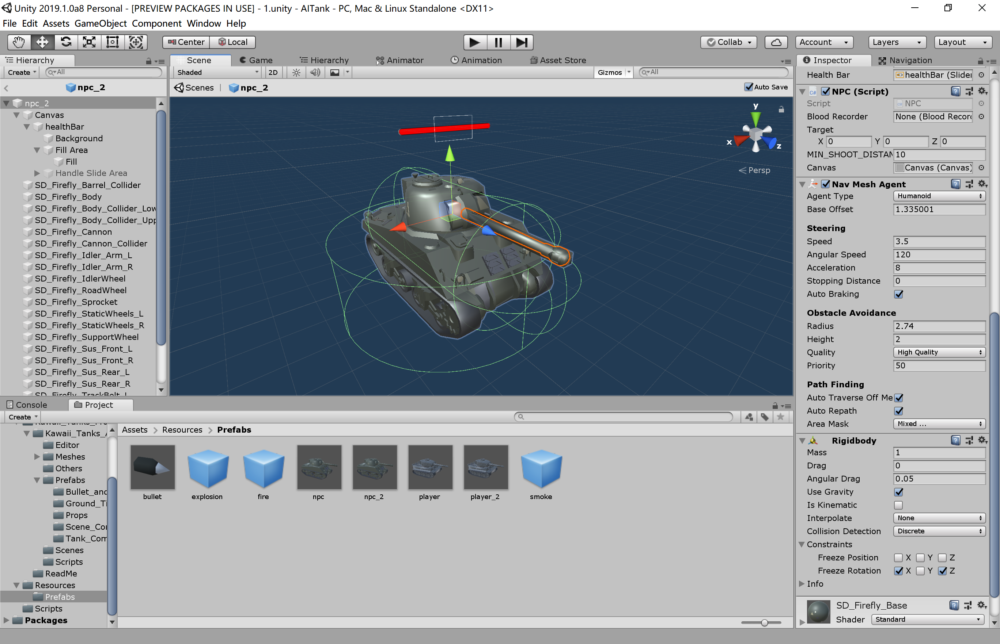
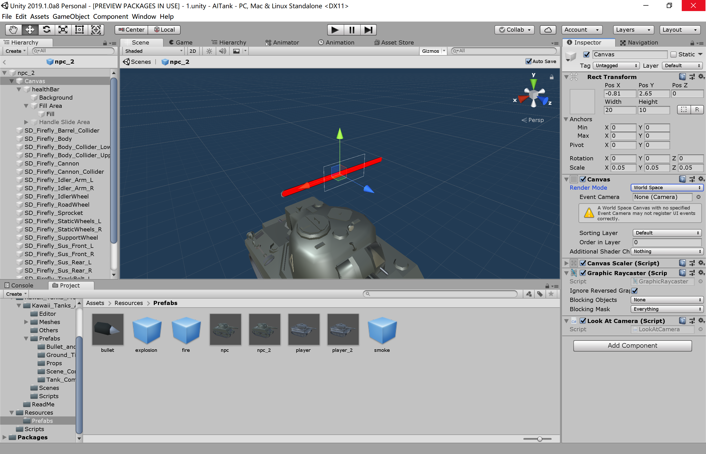
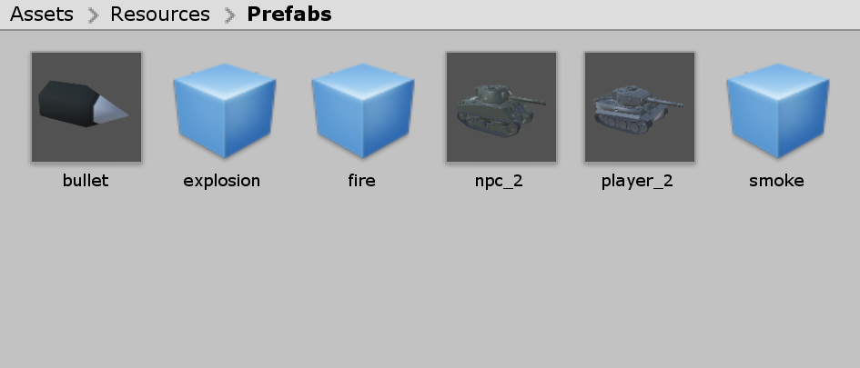

## 坦克大战 - AI Tank

### 演示视频

<a href = "https://www.ixigua.com/i6766469840543678471/">视频地址</a>  
(<a href = "https://github.com/guojj33/Unity3DLearning/blob/master/HW10/assets/AITank.mp4" target = "_blank" >备用地址</a>)

### 文件说明

- 代码放在 [AITank/Assets/Scripts](https://github.com/guojj33/Unity3DLearning/tree/master/HW10/AITank/Assets/Scripts) 中
- 预制放在 [AITank/Assets/Resources/Prefabs](https://github.com/guojj33/Unity3DLearning/tree/master/HW10/AITank/Assets/Resources/Prefabs) 中
- 工程下载到本地后，双击 AITank/Assets/1.unity 即可打开工程

### 准备步骤

1. 搭建场景并烘焙 NavMesh
    打开 Window -> AI -> Navigation，选中各个游戏对象，勾选 Navigation Static，设置地面为 Walkable，墙壁、障碍物为 Not Walkable，然后烘焙，构建 NPC 可走的表面。  
    
3. 坦克预制创建，游戏中有两种坦克，其预制创建基本一致
    - 添加刚体、碰撞器、巡航组件Nav Mesh Agent，调整组件到合适大小。  
    
    - 制作血条。  
    添加 Canvas 子对象，Canvas 添加 Slider 子对象。设置 Canvas 的 Render Mode 为 World Space，Event Camera 属性需要通过脚本在创建游戏对象时赋值为 Main Camera。注意添加 Canvas 时，默认宽高和 Scale 可能为 0，需要自行调节否则看不到血条。设置 Slider 填充颜色，npc 设置为红色，player 设置为蓝色，方便区分。
    
4. 其他预制
    - 子弹
    - 子弹爆炸粒子系统
    - 子弹发射火光粒子系统
    - 子弹爆炸烟雾粒子系统
    
    

### 关键代码
- 游戏事件  
    定义了两个事件，某个 npc 死亡，以及 player 的死亡。
    ```C#
    public class GameEventManager : MonoBehaviour 
    {
        //NPC 死亡事件
        public delegate void NPCDeadEvent(GameObject npc);
        public static event NPCDeadEvent OnNPCDead;
        //玩家死亡事件
        public delegate void PlayerDeadEvent();
        public static event PlayerDeadEvent OnPlayerDead;

        public void NPCDead(GameObject npc) {
            if (OnNPCDead != null) {
                OnNPCDead(npc);
            }
        }

        public void PlayerDead() {
            if (OnPlayerDead != null) {
                OnPlayerDead();
            }
        }
    }
    ```

- npc 脚本  
    挂载在 npc 坦克上，设置其 NavMeshAgent 组件的目标为 player，实现对 player 的追踪。使用 Coroutine 实现间隔发射子弹。当游戏结束时，Coroutine 结束，需要重新创建并执行。当 npc 血量低于零时，创建一个 npc 死亡事件。
    ```C#
    public class NPC : MonoBehaviour {
        public BloodRecorder bloodRecorder;
        public Vector3 target;
        public int MIN_SHOOT_DISTANCE = 100;
        private IEnumerator shootCoroutine;
        private Controller controller;
        public Canvas canvas;

        void Start()
        {
            controller = SSDirector.getInstance().CurrentSceneController as Controller;
            shootCoroutine = shoot(1);
            StartCoroutine(shootCoroutine);
            bloodRecorder = this.GetComponent<BloodRecorder>();
            canvas.worldCamera = Camera.main;
        }

        void Update()
        {
            if(controller.GetGameState() == GameState.Play) {
                if (bloodRecorder.getBlood() <= 0) {
                    this.gameObject.SetActive(false);
                    Singleton<GameEventManager>.Instance.NPCDead(this.gameObject);
                }
                else {
                    target = controller.getPlayerPosition();
                    NavMeshAgent agent = GetComponent<NavMeshAgent>();
                    agent.SetDestination(target);
                }
            }
        }

        IEnumerator shoot(int interval) {
            while(controller.GetGameState() == GameState.Play) {
                yield return new WaitForSeconds(interval);
                if (Vector3.Distance(transform.position, target) < MIN_SHOOT_DISTANCE) {
                    Factory factory = Singleton<Factory>.Instance;
                    GameObject bullet = factory.getBullet("NPC");
                    bullet.transform.position = new Vector3(transform.position.x, 1.2f, transform.position.z) + transform.forward*3.804f;
                    bullet.GetComponent<Bullet>().playFire();
                    bullet.transform.forward = transform.forward;
                    Rigidbody rb = bullet.GetComponent<Rigidbody>();
                    rb.AddForce(bullet.transform.forward * 150, ForceMode.Impulse);
                }
            }
        }
        public void reset()
        {
            bloodRecorder.reset();
            shootCoroutine = shoot(1);
            StartCoroutine(shootCoroutine);
            Debug.Log("NPC reset");
        }
    }
    ```

- player 脚本  
    当 player 血量低于零时，创建一个 player 死亡事件。
    ```C#
    public class Player : MonoBehaviour {
        public BloodRecorder bloodRecorder;
        private Controller controller;
        public Canvas canvas;

        void Awake() {
            canvas.worldCamera = Camera.main;    
        }

        void Start()
        {
            controller = SSDirector.getInstance().CurrentSceneController as Controller;
            bloodRecorder = this.GetComponent<BloodRecorder>();
        }

        void Update()
        {
            if(controller.GetGameState() == GameState.Play) {
                if (bloodRecorder.getBlood() <= 0) {
                    this.gameObject.SetActive(false);
                    Singleton<GameEventManager>.Instance.PlayerDead();
                }
            }
        }

        public void reset()
        {
            transform.position = new Vector3(0, 0, 0);
            bloodRecorder.reset();
        }
    }
    ```

- bullet 脚本  
    bullet 的 tag 有两种，NPC 和 Player，分别表示由 npc 和 player 发射出来。坦克的 tag 也是这两种，分别表示 npc 和 player。只有当碰撞到的对象的 tag 和 bullet 自身的 tag 不同时，才会扣血。playFire 在子弹发射时调用，播放火花效果。撞击到物体时，播放爆炸和烟雾两种效果。碰撞结束后，调用工厂进行回收。
    ```C#
    public class Bullet : MonoBehaviour {
        public float explosionRadius = 5.0f;
        
        public void playFire() {
            Factory myFactory = Singleton<Factory>.Instance;
            ParticleSystem fire = myFactory.getPS("fire");
            fire.transform.position = transform.position;
            fire.Play();
        }

        void OnCollisionEnter(Collision other) {
            Factory myFactory = Singleton<Factory>.Instance;

            ParticleSystem smoke = myFactory.getPS("smoke");
            smoke.transform.position = transform.position;

            ParticleSystem explosion = myFactory.getPS("explosion");
            explosion.transform.position = transform.position;
            Collider[] colliders = Physics.OverlapSphere(transform.position, explosionRadius);
            for (int i = 0; i < colliders.Length; i++) {
                // 如果玩家子弹击中了NPC或者NPC子弹击中了玩家坦克，伤害才有效
                if(colliders[i].tag == "Player" && this.tag == "NPC" || 
                    colliders[i].tag == "NPC" && this.tag == "Player") {
                    Debug.Log("对" + colliders[i].tag + "造成伤害");
                    float distance = Vector3.Distance(colliders[i].transform.position, transform.position);
                    int hurt = (int)(100f/distance/10); // 距离越远伤害越小;
                    Debug.Log("伤害值"+hurt);
                    if(colliders[i].gameObject.activeSelf){
                        colliders[i].GetComponent<BloodRecorder>().reduceBlood(hurt);
                    }
                }
            }
            smoke.Play();
            explosion.Play();
            if(this.gameObject.activeSelf) {
                myFactory.BulletRecycle(this.gameObject);
            }
        }
    }
    ```

- npc、子弹、粒子系统工厂  
    工厂订阅了 npc 死亡事件，事件发生后，调用 OnNPCDead 方法回收该 npc。工厂的 getTank 方法返回新的 npc 或者回收来的 npc。如果是回收来的 npc，由于 npc 的发射子弹协程已经结束，需要调用 NPC 组件的 reset 方法，创建新的发射子弹协程。工厂的 reset 方法在重新开始游戏时调用，作用是将所有正在使用的 npc 全部回收，然后 Controller 再调用工厂的 getTank 获取 npc。
    ```C#
    public class Factory : MonoBehaviour
    {
        private Dictionary<int, GameObject> tanks;
        private Dictionary<int, GameObject> freeTanks;
        private Dictionary<int, GameObject> bullets;
        private Dictionary<int, GameObject> freeBullets;
        private List<ParticleSystem> psQueue;

        void Awake() {
            tanks = new Dictionary<int, GameObject>();
            freeTanks = new Dictionary<int, GameObject>();
            bullets = new Dictionary<int, GameObject>();
            freeBullets = new Dictionary<int, GameObject>();
            psQueue = new List<ParticleSystem>();
            Debug.Log("Factory.Start()");     
        }

        void OnEnable() {
            //订阅事件
            GameEventManager.OnNPCDead += OnNPCDead;
        }

        void OnDisable() {
            GameEventManager.OnNPCDead -= OnNPCDead;
        }

        public GameObject getTank() {
            if(freeTanks.Count == 0) {
                GameObject newTank = Instantiate(Resources.Load<GameObject>("Prefabs/npc_2"), new Vector3(0, 0, 0), Quaternion.identity) as GameObject;
                tanks.Add(newTank.GetInstanceID(), newTank);
                newTank.transform.position = new Vector3(Random.Range(-20,20), 0, Random.Range(-20,20));
                newTank.SetActive(true);
                return newTank;
            }
            else {
                foreach (KeyValuePair<int, GameObject> pair in freeTanks) {
                    pair.Value.SetActive(true);
                    freeTanks.Remove(pair.Key);
                    tanks.Add(pair.Key, pair.Value);
                    pair.Value.transform.position = new Vector3(Random.Range(-20,20), 0, Random.Range(-20,20));
                    pair.Value.GetComponent<NPC>().reset();
                    return pair.Value;
                }
            }
            return null;
        }

        public GameObject getBullet(string tagName) {
            if(freeBullets.Count == 0) {
                GameObject newBullet = Instantiate(Resources.Load<GameObject>("Prefabs/bullet"), new Vector3(0, 0, 0), Quaternion.identity) as GameObject;
                newBullet.tag = tagName;
                bullets.Add(newBullet.GetInstanceID(), newBullet);
                return newBullet;
            }
            else {
                foreach (KeyValuePair<int, GameObject> pair in freeBullets) {
                    pair.Value.SetActive(true);
                    freeBullets.Remove(pair.Key);
                    bullets.Add(pair.Key, pair.Value);
                    pair.Value.tag = tagName;
                    return pair.Value;
                }
            }
            return null;
        }

        public ParticleSystem getPS(string tagName) {
            for (int i = 0; i < psQueue.Count; i++) {
                if(!psQueue[i].isPlaying && psQueue[i].tag == tagName) {
                    return psQueue[i];
                }
            }
            string prefabName = "Prefabs/" + tagName;
            ParticleSystem newPS = Instantiate(Resources.Load<ParticleSystem>(prefabName), new Vector3(0, 0, 0), Quaternion.identity) as ParticleSystem;
            newPS.tag = tagName;
            psQueue.Add(newPS);
            return newPS;
        }

        public void OnNPCDead(GameObject npc) {
            tanks.Remove(npc.GetInstanceID());
            freeTanks.Add(npc.GetInstanceID(), npc);
            npc.GetComponent<Rigidbody>().velocity = new Vector3(0, 0, 0);
            npc.SetActive(false);
        }


        public void BulletRecycle(GameObject bullet) {
            bullets.Remove(bullet.GetInstanceID());
            freeBullets.Add(bullet.GetInstanceID(), bullet);
            bullet.GetComponent<Rigidbody>().velocity = new Vector3(0,0,0);
            bullet.SetActive(false);
        }

        public void reset() {
            //回收所有
            foreach (KeyValuePair<int, GameObject> pair in tanks) {
                pair.Value.SetActive(false);
                freeTanks.Add(pair.Key, pair.Value);
            }
            tanks.Clear();
        }
    }
    ```

- Controller  
    场景控制器订阅了 npc 死亡事件和 player 死亡事件。如果 npc 死了，需要更新 NPCCount，如果全死了，调用 Win 方法。如果 player 死了，调用 Lose 方法。MovePlayer 和 PlayerShoot 实现 player 移动和射击。
    ```C#
    public class Controller : MonoBehaviour, IUserAction, ISceneController
    {
        public GameObject player;
        public GameState gameState;
        public Factory factory;
        public SSDirector director;
        public int MAX_NPC_COUNT = 3;
        public int NPCCount;
        public UserGUI userGUI;
        public GameEventManager gameEventManager;
        public float moveSpeed = 20f;
        public 

        void Start()
        {
            director = SSDirector.getInstance();
            director.CurrentSceneController = this;
            gameEventManager = gameObject.AddComponent<GameEventManager>() as GameEventManager;
            factory = gameObject.AddComponent<Factory>() as Factory;
            userGUI = gameObject.AddComponent<UserGUI>() as UserGUI;
            gameState = GameState.Start;
            NPCCount = MAX_NPC_COUNT;
        }

        public void StartGame() {
            gameState = GameState.Play;
            LoadResources();
            CameraController cc = gameObject.AddComponent<CameraController>() as CameraController;
            cc.player = player;
        }

        public void RestartGame() {
            gameState = GameState.Play;
            NPCCount = MAX_NPC_COUNT;
            //重置 player
            player.SetActive(true);
            player.GetComponent<Player>().reset();
            //将 NPC 全部回收
            factory.reset();
            LoadNPCs();
        }

        // Update is called once per frame
        void Update()
        {
            
        }

        void OnEnable() {
            //订阅事件
            GameEventManager.OnNPCDead += OnNPCDead;
            GameEventManager.OnPlayerDead += OnPlayerDead;
        }

        void OnDisable() {
            GameEventManager.OnNPCDead -= OnNPCDead;
            GameEventManager.OnPlayerDead -= OnPlayerDead;
        }

        public void LoadResources() {
            player = Instantiate(Resources.Load<GameObject>("Prefabs/player_2"), new Vector3(0, 0, 0), Quaternion.identity) as GameObject;
            LoadNPCs();
        }

        public void LoadNPCs() {        
            for (int i = 0; i < NPCCount; ++i) {
                factory.getTank();
            }
        }

        public void MovePlayer(float translationX, float translationZ){
            translationX *= Time.deltaTime;
            translationZ *= Time.deltaTime;
            
            player.transform.LookAt(new Vector3(player.transform.position.x + translationX, player.transform.position.y, player.transform.position.z + translationZ));
            if (translationX == 0)
                player.transform.Translate(0, 0, Mathf.Abs(translationZ) * moveSpeed);
            else if (translationZ == 0)
                player.transform.Translate(0, 0, Mathf.Abs(translationX) * moveSpeed);
            else
                player.transform.Translate(0, 0, (Mathf.Abs(translationZ) + Mathf.Abs(translationX)) * moveSpeed/2);
        }

        public void PlayerShoot() {
            GameObject bullet = factory.getBullet("Player");
            bullet.transform.position = new Vector3(player.transform.position.x, 0.76f, player.transform.position.z) + player.transform.forward*3.683f;
            bullet.transform.forward = player.transform.forward;
            bullet.GetComponent<Bullet>().playFire();
            Rigidbody rb = bullet.GetComponent<Rigidbody>();
            rb.AddForce(bullet.transform.forward * 200, ForceMode.Impulse);
        }

        public Vector3 getPlayerPosition() {
            return player.transform.position;
        }

        public void OnNPCDead(GameObject npc) {
            NPCCount --;
            if(NPCCount <= 0) {
                Win();
            }
        }

        public void OnPlayerDead() {
            Lose();
        }

        public void Win() {
            gameState = GameState.Win;
        }

        public void Lose() {
            gameState = GameState.Lose;
        }

        public GameState GetGameState() {
            return gameState;
        }
    }

    ```

- UserGUI  
    玩家通过方向键控制坦克移动，回车键发射子弹。
    ```C#
    public class UserGUI : MonoBehaviour
    {
        IUserAction action;
        GUIStyle labelStyle;
        GUIStyle buttonStyle;

        void Start() {
            labelStyle = new GUIStyle("label");
            labelStyle.alignment = TextAnchor.MiddleCenter;
            labelStyle.fontSize = 20;
            labelStyle.normal.textColor = Color.white;

            buttonStyle = new GUIStyle("button");
            buttonStyle.alignment = TextAnchor.MiddleCenter;
            buttonStyle.fontSize = 20;
            buttonStyle.normal.textColor = Color.white;

            action = SSDirector.getInstance().CurrentSceneController as IUserAction;
        }

        void Update() {
            if (action.GetGameState() == GameState.Play) {
                // 获取键盘输入
                float translationX = Input.GetAxis("Horizontal");
                float translationZ = Input.GetAxis("Vertical");
                //移动玩家
                action.MovePlayer(translationX, translationZ);
                if(Input.GetKeyDown(KeyCode.Return)) {
                    action.PlayerShoot();
                }
            }
        }

        void OnGUI() {        
            string buttonText = "";
            if (action.GetGameState() == GameState.Start) {
                buttonText = "Start";
            }
            else if (action.GetGameState() == GameState.Lose || action.GetGameState() == GameState.Win) {
                buttonText = "Restart";
            }

            if(action.GetGameState() == GameState.Win) {
                GUI.Label(new Rect(Screen.width/2 - Screen.width/8, Screen.height/2 - Screen.height/8, Screen.width/4, Screen.height/4), "You Win!",labelStyle);
            }
            else if(action.GetGameState() == GameState.Lose) {
                GUI.Label(new Rect(Screen.width/2 - Screen.width/8, Screen.height/2 - Screen.height/8, Screen.width/4, Screen.height/4), "You Lose!",labelStyle);
            }

            if(buttonText != "") {
                if (GUI.Button(new Rect(Screen.width/2 - Screen.width/16, Screen.height/2 - Screen.height/8 + Screen.height/4, Screen.width/8, Screen.height/8), buttonText, buttonStyle)) {
                    if (buttonText == "Start") {
                        action.StartGame();
                    } else if (buttonText == "Restart") {
                        action.RestartGame();
                    }
                }
            }
        }
    }

    ```