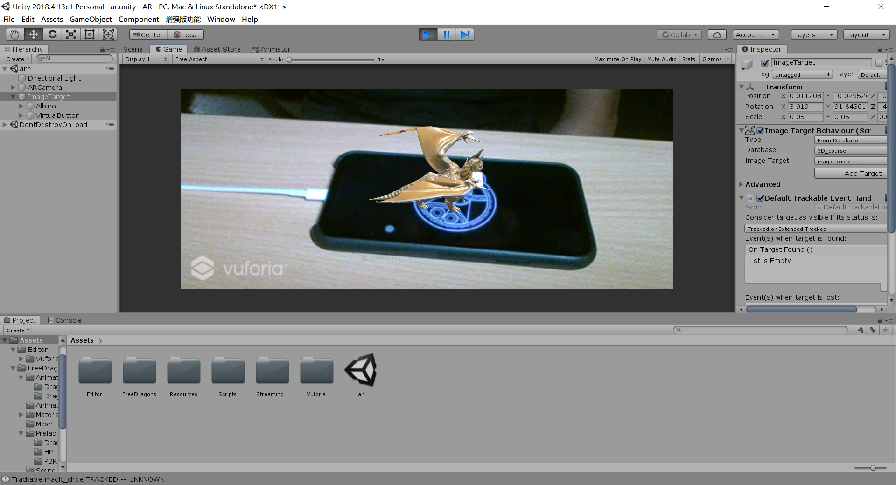

## AR 图像识别与虚拟按键小游戏

### 演示视频

<a href = "">视频地址</a>  
(<a href = "https://github.com/guojj33/Unity3DLearning/blob/master/HW11/assets/AR.mp4" target = "_blank" >备用地址</a>)

### 文件说明

- 代码放在 [AR/Assets/Scripts](https://github.com/guojj33/Unity3DLearning/tree/master/HW11/AR/Assets/Scripts) 中
- 工程下载到本地后，双击 AR/Assets/ar.unity 即可打开工程

### 实验过程

#### 1. 图像识别
- 按照课件的步骤，安装 Vuforia ，添加 ARCamera 到场景中并配置 VuforiaConfiguration
- 添加 Vuforia Engine -> Image ，设置 Image Target Behaviour 组件，使用事先创建的数据库中的图片
- 添加模型到 ImageTarget 中，运行游戏，在手机上显示要识别的图片对准镜头即可识别  
    

#### 2. 虚拟按键
- Image Target -> Image Target Behaviour -> add virtual button 添加虚拟按键，调整按键的位置，可以在按键的位置添加一个 cube 方便查看  
    

- 修改模型的 Animator  ，添加了两个 trigger 变量 Fly 和 Land 之后在脚本中会用到
    

- 创建 VitrualButtonEventHandler.cs 实现 IVirtualButtonEventHandler 接口，实现按下按键就起飞，放开按键就落地的动画效果   
    ```C#
    using System.Collections;
    using System.Collections.Generic;
    using UnityEngine;
    using Vuforia;

    public class VirtualButtonEventHandler : MonoBehaviour, IVirtualButtonEventHandler
    {
        public GameObject vb;
        public Animator ani;

        // Start is called before the first frame update
        void Start()
        {
            VirtualButtonBehaviour vbb = vb.GetComponent<VirtualButtonBehaviour>();
            if (vbb)
            {
                vbb.RegisterEventHandler(this);
            }
        }

        public void OnButtonPressed(VirtualButtonBehaviour vb)
        {
            ani.SetTrigger("Fly");
            Debug.Log("按钮按下");
        }

        public void OnButtonReleased(VirtualButtonBehaviour vb)
        {
            ani.SetTrigger("Land");
            Debug.Log("按钮释放");
        }
    }
    ```

- 运行游戏  
    