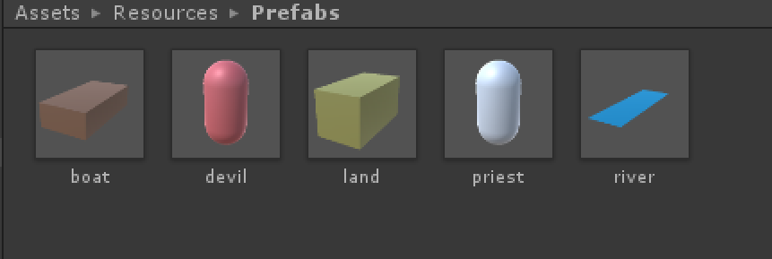

## Priests and Devils 牧师与魔鬼

### 演示视频
[视频地址]()  
([备用地址]())

### 游戏脚本

>Priests and Devils
Priests and Devils is a puzzle game in which you will help the Priests and Devils to cross the river within the time limit. There are 3 priests and 3 devils at one side of the river. They all want to get to the other side of this river, but there is only one boat and this boat can only carry two persons each time. And there must be one person steering the boat from one side to the other side. In the flash game, you can click on them to move them and click the go button to move the boat to the other direction. If the priests are out numbered by the devils on either side of the river, they get killed and the game is over. You can try it in many > ways. Keep all priests alive! Good luck!

### 程序要求

1. [play the game](http://www.flash-game.net/game/2535/priests-and-devils.html)
2. 列出游戏中提及的事物（Objects）
3. 用表格列出玩家动作表（规则表），注意，动作越少越好
4. 请将游戏中对象做成预制
5. 在 GenGameObjects 中创建 长方形、正方形、球 及其色彩代表游戏中的对象。
6. 使用 C# 集合类型 有效组织对象
7. 整个游戏仅 主摄像机 和 一个 Empty 对象， **其他对象必须代码动态生成！！！** 。 整个游戏不许出现 Find 游戏对象， SendMessage 这类突破程序结构的 通讯耦合 语句。 **违背本条准则，不给分**
8. 请使用课件架构图编程，**不接受非 MVC 结构程序**  
9. 注意细节，例如：船未靠岸，牧师与魔鬼上下船运动中，均不能接受用户事件！

### 程序设计

#### 1.游戏中提到的事物（Objects）
牧师，魔鬼，船，河流，两岸

#### 2.玩家动作表（规则表）

玩家动作|执行条件|执行结果
-------|:------:|-------
点击牧师/魔鬼|游戏未结束，船没有移动，角色在船上或与在同一边|牧师/魔鬼移动
点击船|游戏未结束且没有其他物体在移动，船上至少有一人|船移动
点击Restart||游戏重置

#### 3.预制



* 魔鬼和牧师都用胶囊对象表示，前者用红色，后者用白色表示
* 土地用长方体对象，河用平面对象
* 设计好对象后添加到预制文件夹中，供脚本在游戏运行时动态加载生成


#### 4.MVC架构代码

##### 1.SSDirector

导演类。继承了 System.Object ，保持导演类一直存在，其主要职责是安排和切换场景，包含了场景控制器接口。在这个游戏中由于只有一个场景，所以其职能表现不是特别明显

```C#
	public class SSDirector : System.Object {
		private static SSDirector _instance;

		public ISceneController CurrentSceneController { get; set; }

		public static SSDirector getInstance() {
			if (_instance == null) {
				_instance = new SSDirector ();
			}
			return _instance;
		}
	}
```

##### 2.ISceneController

场景控制器接口。通过这个接口，导演可以得知当前场景控制器是谁并传达要求

```C#
	public interface ISceneController {
		void loadResources();
	}
```

##### 3.IUserAction

用户操作与游戏响应的接口。用户通过键盘、鼠标等输入设备与游戏交互，将会触发某些行为，这里就包括船移动，人物移动，重置游戏对象

```C#
	public interface IUserAction {
		void moveBoat();
		void moveRole(roleModel role);
		void restart();
	}
```

##### 4.Controller

场景控制器。继承了场景控制器就扣和用户操作接口，实现创建场景，控制对象的功能。

```C#
	public class Controller : MonoBehaviour, ISceneController, IUserAction {
		public landModel startLand;
		public landModel endLand;
		public boatModel boat;
		private roleModel[] roles;

		UserGUI userGui;

		void Start(){
			SSDirector director = SSDirector.getInstance ();
			director.CurrentSceneController = this;
			userGui = gameObject.AddComponent<UserGUI> () as UserGUI;
			loadResources ();
		}

		//.....
	}
```

##### 5.UserGUI

建立用户交互界面，包括重置按钮，游戏结果显示。这里使用了 guiFlag 变量，以将 按钮被按下 等用户交互产生的信息传送给 Controller ，Controller 会根据这些信息产生响应。

```C#
	public class UserGUI : MonoBehaviour {
		public int guiFlag = 1;	//0 for restart, 1 for continue, 2 for win, 3 for lose, used to communicate with the controller
		// Use this for initialization
		void Start ();

		void OnGUI();
	}
```

##### 6.Models 各种游戏对象

* roleModel  
	roleFlag 表明是牧师还是魔鬼  
	onBoat 表明在船还是陆地上  
	click 和 move 利用代理实现人物的被点击和运动功能  
	shutDownClickReaction() 和 turnOnClickReaction() 用于开启和关闭人物的响应功能，例如，当人在移动的船上时，就必须关闭响应功能
	lastPosition 记录人物的在上一帧的位置，通过 isMoving() 函数，与当前帧位置比较，判断人物是否移动

```C#
	public class roleModel {
		GameObject role;
		int roleFlag;	//0 for priest, 1 for devil

		bool onBoat = false;

		Click click;
		Move move;

		public Vector3 lastPosition;

		landModel land = (SSDirector.getInstance().CurrentSceneController as Controller).startLand;
		boatModel boat = (SSDirector.getInstance().CurrentSceneController as Controller).boat;

		public roleModel (int roleFlag);

		public bool isOnBoat ();

		public bool moveTo (Vector3 position);

		public void getOnLand (landModel land);

		public void getOnBoat (boatModel boat);

		public void shutDownClickReaction ();

		public void turnOnClickReaction ();

		public void reset ();

		public bool isMoving();

		//....
	}
```

* landModel  
	landFlag 表明是起始陆地还是结束陆地，分别为正负1  
	positions 存储陆地上供角色站立的位置的坐标  
	roles 存储陆地上当前站了哪些人物  
	这里设计两块陆地的位置是关于 OYZ 平面对称的，因此两块陆地以及陆地上相应的位置的坐标只有 X 坐标是对称的，所以可以设置好所需的 X 坐标的绝对值，如landXPositionABS 这个变量，再利用 landFlag 来获得准确的坐标  
	陆地主要有获得空位坐标，增加人物，删除人物等功能

```C#
	public class landModel {
		GameObject land;
		Vector3[] positions;
		int landFlag;	//1 for startLand, -1 for endLand
		roleModel[] roles = new roleModel [6];

		private const float roleYPosition = 0.85F;
		private const float roleZPosition = 0F;
		private const float roleXPosInterval = 0.3F;
		private const float firstRoleXPosition = 3.5F;

		private const float landXPositionABS = 2.43F;
		private const float landYPosition = 0.1F;
		private const float landZPosition = 0F;

		public landModel (int flag);
			
		public int getEmptyPosIndex ();

		public Vector3 getEmptyPosition ();

		public void addRole (roleModel role);

		public roleModel deleteRole(string roleName);

		public void reset ();

		//......
	}
```

* boatModel  
	船可以当作一块能移动的陆地来看，因此其本身坐标以及乘客坐标的处理可以参考 landModel  
	click 和 move 实现船的点击移动功能  
	与 roleModel 一样，包含 shutDownClickReaction() 和 turnOnClickReaction() ，使用的时机包括当乘客在上船但还没到时，船必须关闭点击移动的功能。

```C#
	public class boatModel {
		GameObject boat;

		Vector3[] startLandPassengersPos;
		Vector3[] endLandPassengersPos;

		const float passengerYPos = 0.48F;
		const float passengerZPos = 0F;
		const float passengerXInterval = 0.4F;

		roleModel[] roles = new roleModel[2];

		Vector3 lastPosition;

		Move move;
		public Click click;

		Vector3 startPos = new Vector3 (0.9F, 0.11F, 0F);
		Vector3 endPos = new Vector3 (-0.9F, 0.11F, 0F);

		int boatFlag = 1;	//1 for start land side, -1 for end land side, similar to landFlag

		public boatModel ();

		public bool isEmpty ();

		public bool isMoving ();

		public void shutDownClickReaction ();

		public void turnOnClickReaction ();

		public void boatMove ();

		public int getEmptyPosIndex ();

		public Vector3 getEmptyPosistion ();

		public void addRole (roleModel role);

		public roleModel deleteRole (string name);

		//...
	}
```

##### 7.其他脚本

* click脚本  
	当对象被点击时，将会感知并调用 IUserAction 的响应函数

```C#
	public class Click : MonoBehaviour {
		IUserAction action;
		roleModel role = null;
		boatModel boat = null;

		public void setRole(roleModel role);

		public void setBoat(boatModel boat);

		void Start() {
			action = SSDirector.getInstance ().CurrentSceneController as IUserAction;
		}

		void OnMouseDown () {
			if (boat == null && role == null)
				return;
			if (role != null) {
				action.moveRole (role);
			}
			else if (boat != null) {
				action.moveBoat ();
			}
		}
	}
```

* move脚本  
	实现船水平移动；  
	人物上船时，由于设置了岸比船高，会先水平再垂直移动，下船时，先垂直再水平移动


```C#
	public class Move : MonoBehaviour {
		float speed = 5;
		int moveFlag = 0;	//0 for no action, 1 for move vertically, 2 for move horizontally
		Vector3 endPosition;
		Vector3 tempPosition;

		void Update () {
			if (moveFlag == 1) {
				transform.position = Vector3
					.MoveTowards (transform.position, tempPosition, speed * Time.deltaTime);
				if (transform.position == tempPosition) {
					moveFlag = 2;
				}
			}
			if (moveFlag == 2) {
				transform.position = Vector3.MoveTowards (transform.position, endPosition, speed * Time.deltaTime);
				if (transform.position == endPosition)
					moveFlag = 0;
			}
		}

		public void moveTo (Vector3 position) {
			endPosition = position;
			if (position.y == transform.position.y) {	//boat moves
				moveFlag = 2;
			} else if (position.y < transform.position.y) {	//role move from land to boat
				moveFlag = 1;
				tempPosition = new Vector3 (position.x, transform.position.y, position.x);
			} else if (position.y > transform.position.y) {	//role move from boat to land
				moveFlag = 1;
				tempPosition = new Vector3 (transform.position.x, position.y, transform.position.z);
			}
		}
	}
```

#### 5.细节处理

根据游戏规则，当有乘客在移动时，船不能动，当船在移动时，人不能动。另外，当游戏结束时（成功或失败），所有人和船都不能动。  
所以在 Controller 的 Update 中要添加检测运动函数，时刻更新人或船的点击运动功能是否开启。  
检测是否运动的方法是判断对象上一帧和当前帧的位置是否不同，是则对象在运动。  
关闭对象的运动功能的方法是将对象的 click 成员变量的 role 或 boat 成员变量设置为 null 。  

```C#
	//Controller
	void Update () {
		updateBoatClickReaction ();
		updateRolesClickReaction ();
		if(userGui.guiFlag == 0) {
			Debug.Log ("LateUpdate(): userGUi.guiFlag = " + userGui.guiFlag);
			restart ();
			userGui.guiFlag = 1;
		}
		if (check() == 0) {	//continue
			userGui.guiFlag = 1;
		}
		else if (check() == 1) {	//win
			userGui.guiFlag = 2;
		}
		else if (check() == -1) {	//lose
			userGui.guiFlag = 3;
		}
	}

	void updateBoatClickReaction () {
		if (check() != 0) {
			boat.shutDownClickReaction ();
			return;
		}
		for (int i = 0; i < roles.Length; ++i) {
			if (roles[i].isMoving()) {
				boat.shutDownClickReaction ();
				return;
			}
		}
		boat.turnOnClickReaction ();
	}

	void updateRolesClickReaction () {
		if (boat.isMoving () || check () != 0) {
			for (int i = 0; i < roles.Length; ++i) {
				roles[i].shutDownClickReaction();
			}
		}
		else {
			for (int i = 0; i < roles.Length; ++i) {
				roles[i].turnOnClickReaction ();
			}
		}
	}
```

### 本实验参考博客 [https://blog.csdn.net/c486c/article/details/79795708](https://blog.csdn.net/c486c/article/details/79795708)