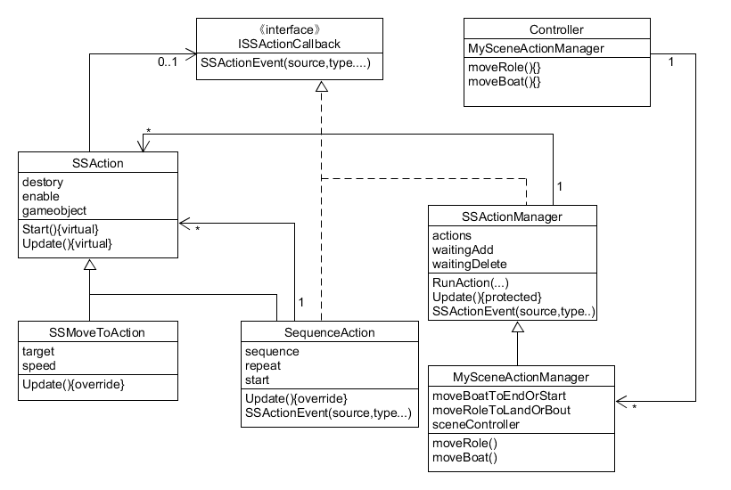

## Priests and Devils 牧师与魔鬼（动作分离版）

### 演示视频

<a href = "https://www.ixigua.com/i6741001841384882189/">视频地址</a>  
(<a href = "https://github.com/guojj33/Unity3DLearning/blob/master/HW4/assets/PriestsAndDevils_v2.mp4" target = "_blank" >备用地址</a>)

### 文件说明

* 预设放在 [PriestsAndDevils/Assets/Resources/Prefabs](https://github.com/guojj33/Unity3DLearning/tree/master/HW4/PriestsAndDevils/Assets/Resources/Prefabs) 中
* 代码放在 [PriestsAndDevils/Assets/Scripts](https://github.com/guojj33/Unity3DLearning/tree/master/HW4/PriestsAndDevils/Assets/Scripts) 中
* 工程下载到本地后，双击 PriestsAndDevils/Assets/2.unity 即可打开工程

### 改进目的与途径

将所有需要移动的游戏对象的移动方法提取出来，由动作管理器来管理和实现所有的移动，动作管理器再由场景控制器来调用，使得运动功能的具体实现从场景控制器和游戏对象类中剥离，便于管理，同时提高运动代码的复用性。  

### 动作管理类图



### 动作管理类描述与实现

- ISSActionCallback（动作事件接口）  
作为动作和动作管理者的接口（组合动作可以是动作和动作管理者）。当动作完成时，动作会调用接口的回调函数，即将完成信息发送给动作管理者，动作管理者便进行下一步操作。  
```C#
public interface ISSActionCallback
{
    void SSActionEvent(SSAction source, SSActionEventType events = SSActionEventType.Competeted,
        int intParam = 0, string strParam = null, Object objectParam = null);
}
```

- SSActionManager（动作管理器基类）  
向动作管理器传入游戏对象并指定动作或组合动作，就可以实现对象的动作。当动作完成时，动作调用回调函数 SSActionEvent() 使动作管理器进行下一步操作。  
```C#
public class SSActionManager : MonoBehaviour, ISSActionCallback                      //action管理器
{

    private Dictionary<int, SSAction> actions = new Dictionary<int, SSAction>();    //将执行的动作的字典集合,int为key，SSAction为value
    private List<SSAction> waitingAdd = new List<SSAction>();                       //等待去执行的动作列表
    private List<int> waitingDelete = new List<int>();                              //等待删除的动作的key                

    protected void Update();

    public void RunAction(GameObject gameobject, SSAction action, ISSActionCallback manager);

    public void SSActionEvent(SSAction source, SSActionEventType events = SSActionEventType.Competeted,
        int intParam = 0, string strParam = null, Object objectParam = null);

	public void Reset ();
}
```

- SSAction（动作基类）  
虚函数 Start() 和 Update() 将由动作子类重写，完成动作具体实现。  
```C#
public class SSAction : ScriptableObject
{
	public bool enable = true;
	public bool destroy = false;

	public GameObject gameobject;
	public Transform transform;
	public ISSActionCallback callback;

	protected SSAction() { }

	public virtual void Start()
	{
		throw new System.NotImplementedException();
	}

	public virtual void Update()
	{
		throw new System.NotImplementedException();
	}
}
```

- SSMoveToAction（移动动作实现）  
游戏中最基本动作，移动到目标位置  
```C#
public class SSMoveToAction : SSAction
{
	public Vector3 target;
	public float speed;

	private SSMoveToAction() { }
	public static SSMoveToAction GetSSAction(Vector3 target, float speed)
	{
		SSMoveToAction action = ScriptableObject.CreateInstance<SSMoveToAction>();
		action.target = target;
		action.speed = speed;
		return action;
	}

	public override void Update()
    {
        this.transform.position = Vector3.MoveTowards(this.transform.position, target, speed * Time.deltaTime);
        if (this.transform.position == target)
        {
            this.destroy = true;
            this.callback.SSActionEvent(this);      //调用回调函数，告诉动作管理或动作组合这个动作已完成
        }
    }

    public override void Start()
    {
        //移动动作建立时候不做任何事情
    }
}
```

- SequenceAction （组合动作实现）  
实现组合动作按序完成、重复执行。当动作序列中的一个动作完成后，该动作会调用组合动作类的回调函数，使组合动作类进行下一步操作，这些操作包括，执行下一个动作、重复动作序列、调用动作管理器的回调函数。  
```C#
public class SequenceAction : SSAction, ISSActionCallback
{
    public List<SSAction> sequence;    //动作的列表
    public int repeat = -1;            //-1就是无限循环做组合中的动作
    public int start = 0;              //当前做的动作的索引

    public static SequenceAction GetSSAcition(int repeat, int start, List<SSAction> sequence)
    {
        SequenceAction action = ScriptableObject.CreateInstance<SequenceAction>();//让unity自己创建一个SequenceAction实例
        action.repeat = repeat;
        action.sequence = sequence;
        action.start = start;
        return action;
    }

    public override void Update()
    {
        if (sequence.Count == 0) return;
        if (start < sequence.Count)
        {
            sequence[start].Update();     //一个组合中的一个动作执行完后会调用接口,所以这里看似没有start++实则是在回调接口函数中实现
        }
    }

    public void SSActionEvent(SSAction source, SSActionEventType events = SSActionEventType.Competeted,
        int intParam = 0, string strParam = null, Object objectParam = null)
    {
        source.destroy = false;          //先保留这个动作，如果是无限循环动作组合之后还需要使用
        this.start++;
        if (this.start >= sequence.Count)
        {
            this.start = 0;
            if (repeat > 0) repeat--;
            if (repeat == 0)
            {
                this.destroy = true;               //整个组合动作就删除
                this.callback.SSActionEvent(this); //告诉组合动作的管理对象组合做完了
            }
        }
    }

    public override void Start()
    {
        foreach (SSAction action in sequence)
        {
            action.gameobject = this.gameobject;
            action.transform = this.transform;
            action.callback = this;                //组合动作的每个小的动作的回调是这个组合动作
            action.Start();
        }
    }

    void OnDestroy()
    {
        //如果组合动作做完第一个动作突然不要它继续做了，那么后面的具体的动作需要被释放
    }
}
```

- MySceneActionManager（动作管理器实现）  
```C#
public class MySceneActionManager : SSActionManager  //本游戏管理器
{

    private SSMoveToAction moveBoatToEndOrStart;     //移动船到结束岸，移动船到开始岸
    private SequenceAction moveRoleToLandorBoat;     //移动角色到陆地，移动角色到船上

    public Controller sceneController;

    protected void Start()//
    {
        sceneController = (Controller)SSDirector.getInstance().CurrentSceneController;
        sceneController.actionManager = this;
    }
    public void moveBoat(GameObject boat, Vector3 target, float speed)
    {
        moveBoatToEndOrStart = SSMoveToAction.GetSSAction(target, speed);//创建 SSMoveToAction 对象
        this.RunAction(boat, moveBoatToEndOrStart, this);
    }

    public void moveRole(GameObject role, Vector3 middle_pos, Vector3 end_pos, float speed)
    {
        SSAction action1 = SSMoveToAction.GetSSAction(middle_pos, speed);
        SSAction action2 = SSMoveToAction.GetSSAction(end_pos, speed);
        moveRoleToLandorBoat = SequenceAction.GetSSAcition(1, 0, new List<SSAction> { action1, action2 });
        this.RunAction(role, moveRoleToLandorBoat, this);
    }
}
```

- Controller 类主要修改  
控制器类新增 MySceneActionManager 成员，管理实现角色和船的移动。  
```C#
    public MySceneActionManager actionManager;
	//change in v2
	public void moveBoat() {
		if (boat.isEmpty ())
			return;
		//action
		Vector3 target = boat.getBoatFlag () == 1 ? boat.getEndPos () : boat.getStartPos ();
		actionManager.moveBoat (boat.getBoat (), target, 100 * Time.deltaTime );
		boat.setBoatFlag (- boat.getBoatFlag ());
	}

	//change in v2
	public void moveRole(roleModel role) {
		if (role.isOnBoat ()) {	// from boat to land
			landModel land;
			if (boat.getBoatFlag () == 1) 
				land = startLand;
			else land = endLand;
			boat.deleteRole (role.getName ());
			//action
			Vector3 startPos = role.getPosition ();
			Vector3 endPos = land.getEmptyPosition ();
			Vector3 middlePos = new Vector3 (startPos.x, endPos.y, startPos.z);
			actionManager.moveRole (role.getRole (), middlePos, endPos, 100 * Time.deltaTime );
			land.addRole (role);
			role.getOnLand (land);
		}
		else if (!role.isOnBoat ()){					//from land to boat
			landModel land = role.getLand ();
			if (boat.getEmptyPosIndex () == -1 || boat.getBoatFlag () != land.getLandFlag ()) {
				return;
			}
			land.deleteRole (role.getName ());
			//action	
			Vector3 startPos = role.getPosition ();
			Vector3 endPos = boat.getEmptyPosition ();
			Vector3 middlePos = new Vector3 (endPos.x, startPos.y, startPos.z);
			actionManager.moveRole (role.getRole (), middlePos, endPos, 100 * Time.deltaTime );
			boat.addRole (role);
			role.getOnBoat (boat);
		}
	}
```

### 新增裁判类
- 裁判事件接口  
控制器与裁判交互的接口。由控制器继承后，裁判判定当前战局后，通过回调函数 JudgeEven() 通知控制器。  
```C#
    public interface IJudgeCallback
    {
        void JudgeEvent(JudgeEventType events);
    }
```

- 裁判类  
在 Update() 中实时检测当前状况，并调用回调函数通知控制器。  
```C#
    public class Judge : MonoBehaviour
    {
        landModel startLand;
        landModel endLand;
        boatModel boat;
        public IJudgeCallback callback;
        public Controller sceneController;

        void Start ()
        {
            sceneController = (Controller)SSDirector.getInstance().CurrentSceneController;
            startLand = sceneController.startLand;
            endLand = sceneController.endLand;
            boat = sceneController.boat;
            callback = sceneController;
            sceneController.judge = this;
        }

        protected void Update ()
        {
            int[] startLandCount = startLand.getRoleCount ();
            int[] endLandCount = endLand.getRoleCount ();
            int[] boatCount = boat.getRoleCount ();

            int startPriestsCount = startLandCount[0];	//including roles on boat if the boat is at the same side
            int startDevilsCount = startLandCount[1];

            int endPriestsCount = endLandCount[0];
            int endDevilsCount = endLandCount[1];
            
            int boatPriestsCount = boatCount[0];
            int boatDevilsCount = boatCount[1];

            if (boat.getBoatFlag () == 1) {
                startPriestsCount += boatPriestsCount;
                startDevilsCount += boatDevilsCount;
            }
            else if (boat.getBoatFlag () == -1) {
                endPriestsCount += boatPriestsCount;
                endDevilsCount += boatDevilsCount;
            }

            if ((startPriestsCount > 0 && startDevilsCount > startPriestsCount) || (endPriestsCount > 0 && endDevilsCount > endPriestsCount)){	//lose
                callback.JudgeEvent (JudgeEventType.lose);
            }
            else if (startDevilsCount + startPriestsCount == 0 && endPriestsCount + endDevilsCount == 6 && boatPriestsCount == 0 && boatDevilsCount == 0) {	//win
                callback.JudgeEvent (JudgeEventType.win);
            }
            else callback.JudgeEvent (JudgeEventType.unfinish);	//continue playing
        }
    }
```

- 控制器实现裁判事件接口  
控制器接收裁判的消息并作相应处理。  
```C#
	public void JudgeEvent (JudgeEventType type) {
		judgement = type;
		if (type == JudgeEventType.unfinish) {	//continue
			userGui.guiFlag = guiFlagType.unfinish;
		}
		else if (type == JudgeEventType.win) {	//win
			userGui.guiFlag = guiFlagType.win;
		}
		else if (type == JudgeEventType.lose) {	//lose
			userGui.guiFlag = guiFlagType.lose;
		}
	}
```
### 细节与改进
- 使用枚举变量使代码更易读  
```C#
    public enum JudgeEventType : int { lose, win, unfinish }
```

- 重置游戏时中断正在执行的动作  
Controller 的重置函数需要增加运行 SSActionManager 的重置函数，清楚所有正在执行和将要执行的动作，防止在对象仍在移动时重置对象的位置后又继续执行移动操作。  
```C#
    //SSActionManager
    private Dictionary<int, SSAction> actions = new Dictionary<int, SSAction>();    //将执行的动作的字典集合,int为key，SSAction为value
    private List<SSAction> waitingAdd = new List<SSAction>();                       //等待去执行的动作列表
    private List<int> waitingDelete = new List<int>();

	public void Reset () {
		waitingAdd.Clear ();
		waitingDelete.Clear ();
		actions.Clear ();
	}
```