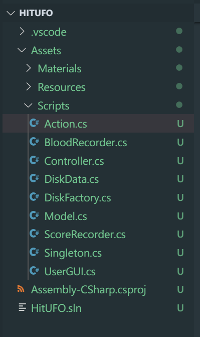

## Priests and Devils 牧师与魔鬼（动作分离版）

### 演示视频

<a href = "">视频地址</a>  
(<a href = "https://github.com/guojj33/Unity3DLearning/blob/master/HW5/assets/HitUFO.mp4" target = "_blank" >备用地址</a>)

### 文件说明

* 代码放在 [HitUFO/Assets/Scripts](https://github.com/guojj33/Unity3DLearning/tree/master/HW5/HitUFO/Assets/Scripts) 中
* 工程下载到本地后，双击 HitUFO/Assets/ufo.unity 即可打开工程

### 游戏要求

#### 1. 游戏内容要求：
- 游戏有 n 个 round，每个 round 都包括 10 次 trial；
- 每个 trial 的飞碟的色彩、大小、发射位置、速度、角度、同时出现的个数都可能不同。它们由该 round 的 ruler 控制；
- 每个 trial 的飞碟有随机性，总体难度随 round 上升；
- 鼠标点中得分，得分规则按色彩、大小、速度不同计算，规则可自由设定。

#### 2. 游戏的要求：
- 使用带缓存的工厂模式管理不同飞碟的生产与回收，该工厂必须是场景单实例的！具体实现见参考资源 Singleton 模板类
- 近可能使用前面 MVC 结构实现人机交互与游戏模型分离

#### 游戏设计
若设置了每个 round 中只出现 10 个飞碟，则游戏得分并没有意义，所以设计游戏规则为：  
- 玩家初始有 30 滴血，错过飞碟将会扣血，扣血量 红色-1 黄色-2 蓝色-3  
- 初试分数为 0 ，击中飞碟会增加分数，红色+2 黄色+4 蓝色+6  
- 当分数超过 20 时进入 round2 ，超过 45 时进入 round3 ，round 增加时，出现的飞碟种类增加，飞碟出现的间隔时间会减小，移动平均速度会增加。  

#### 部分关键代码设计
代码结构仍然是 MVC 结构，具有动作管理器类，飞碟工厂类，分数计数器类，血量计数器类，以及用于实现单实例的 Singleton 类。  


- 飞碟工厂  
负责生产和回收飞碟功能的实现。当飞碟飞出视线或者被击中时调用其 FreeDisk 方法即可回收。调用 GetDisk 方法会优先从回收来的飞碟中获取飞碟。
```C#
public class DiskFactory : MonoBehaviour {
	public GameObject disk_prefab = null;                 //飞碟预制体

    //回收飞碟
    public List<DiskData> used = new List<DiskData>();   //正在被使用的飞碟列表
    public List<DiskData> free = new List<DiskData>();   //空闲的飞碟列表

    public GameObject GetDisk(int round);

    //回收飞碟
    public void FreeDisk(GameObject disk) {
        for(int i = 0; i < used.Count; i++) {
            if (disk.GetInstanceID() == used[i].gameObject.GetInstanceID()) {
                used[i].gameObject.SetActive(false);
                free.Add(used[i]);
                used.Remove(used[i]);
                break;
            }
        }
    }

}
```

- 实现按某一间隔抛出飞碟  
利用 CancelInvoke 和 InvokeRepeating 实现取消或者激活某一函数按某一周期不断运行。这里按照一定时间间隔调用 LoadResources 函数，该函数从 DiskFactory 中获得飞碟并加入到待发出的飞碟队列 diskQueue 中。 Update 函数调用 SendDisk 函数只在 diskQueue 中有飞碟时才能抛飞碟。  
```C#
    //Controller.cs
    public Queue<GameObject> diskQueue = new Queue<GameObject> ();

    public List<GameObject> diskMissed = new List<GameObject> ();

    void Update () {
        if (isGameStarted) {
            if (isGameOver) {
                CancelInvoke("LoadResources");
                return;
            }
            if (!isGamePlaying) {
                InvokeRepeating ("LoadResources", 1f, interalTime);
                isGamePlaying = true;
            }
            SendDisk ();
            if (scoreRecorder.score >= scoreRound2 && currentRound == 1) {
                currentRound = 2;
                interalTime -= 0.5F;
                CancelInvoke("LoadResources");
                isGamePlaying = false;
            }
            if (scoreRecorder.score >= scoreRound3 && currentRound == 2) {
                currentRound = 3;
                interalTime -= 0.3F;
                CancelInvoke("LoadResources");
                isGamePlaying = false;//
            }
        }
    }

    public void LoadResources () {
        diskQueue.Enqueue (diskFactory.GetDisk(currentRound));
    }

    private void SendDisk () {
        float position_x = 10;
        if (diskQueue.Count > 0) {
            GameObject disk = diskQueue.Dequeue ();
            diskMissed.Add(disk);
            float ran_y = Random.Range(3f, 5f);
            float ran_x = Random.Range(-1f, 1f) <= 0 ? -1F : 1F;//从左边出还是右边出
            disk.GetComponent<DiskData>().direction = new Vector3(ran_x, 0, 0);//
            Vector3 position = new Vector3(-ran_x * position_x, ran_y, 0);
            disk.transform.position = position;
            disk.SetActive (true);
            actionManager.throwDisk(disk);
        }

    }
```

- 鼠标输入响应（打飞碟）
用到射线，若射线碰撞到了飞碟，则飞碟被打中。打中时调用 scoreRecorder.Record 加分，并设置被击中飞碟的位置为 (0, 9, 0)，这是一个在视线外的坐标，这样飞碟就消失了。  
```C#
    //Controller.cs
    public void hit (Vector3 pos) {
        if (isGameOver == true)
            return;
        Ray ray = Camera.main.ScreenPointToRay(pos);
        RaycastHit[] hits;
        hits = Physics.RaycastAll(ray);
        bool not_hit = false;
        for (int i = 0; i < hits.Length; i++)
        {
            RaycastHit hit = hits[i];
            //射线打中物体
            if (hit.collider.gameObject.GetComponent<DiskData>() != null) {
                //射中的物体要在没有打中的飞碟列表中
                for (int j = 0; j < diskMissed.Count; j++) {
                    if (hit.collider.gameObject.GetInstanceID() == diskMissed[j].gameObject.GetInstanceID()) {
                        not_hit = true;
                    }
                }
                if(!not_hit) {
                    return;
                }
                Debug.Log("hit: " + hit.collider.gameObject.name);
                diskMissed.Remove (hit.collider.gameObject);
                scoreRecorder.Record (hit.collider.gameObject);
                hit.collider.gameObject.transform.position = new Vector3(0, -9, 0);
                break;
            }
        }

    }
```


- 区分飞碟是被击中还是离开了视线  
飞碟被击中，其纵坐标立马被设置为 -9 ；飞碟飞行到纵坐标小于 -6 时，规定为飞出视线。则某一时刻当飞碟纵坐标大于 -9 且 小于 -6 时，它一定是飞出了视线而不是被击中，此时调用 blooadRecorder.Record 进行扣血  
```C#
public class SSFlyAction : SSAction {
    float acceleration; //重力加速度
    public float horizontalSpeed = 5F;  //horizontalSpeed是飞碟水平方向的速度
    Vector3 direction;  //direction是飞碟的初始飞行方向
    float time;//time是飞碟已经飞行的时间
 
	public override void Start () {
        enable = true;
    }
 
    public override void Update () {
        if (gameobject.activeSelf) {
            transform.Translate(new Vector3(gameobject.GetComponent<DiskData>().direction.x*Time.deltaTime * horizontalSpeed, -Time.deltaTime*2F, 0));
            //飞碟落地
            if (this.transform.position.y < -6) {
                if(this.transform.position.y > -9){
                    BloodRecorder bloodRecorder;
                    bloodRecorder = Singleton<BloodRecorder>.Instance;
                    bloodRecorder.Record(this.gameobject);
                }
                this.destroy = true;
                this.enable = false;
                this.callback.SSActionEvent(this);
            }
        }
	}
 
    public static SSFlyAction GetSSAction();
}
```