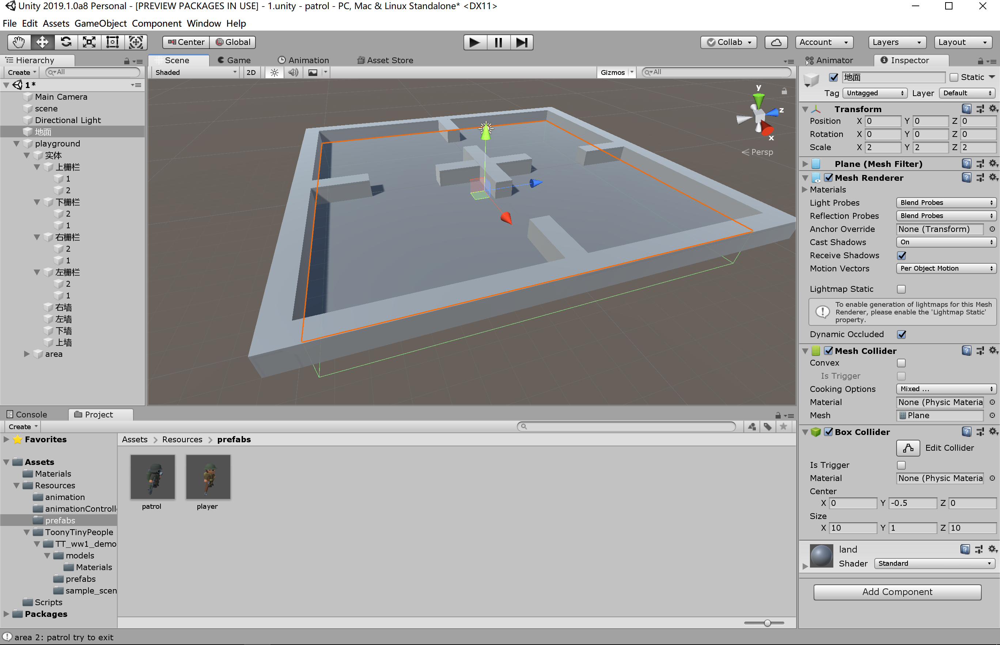
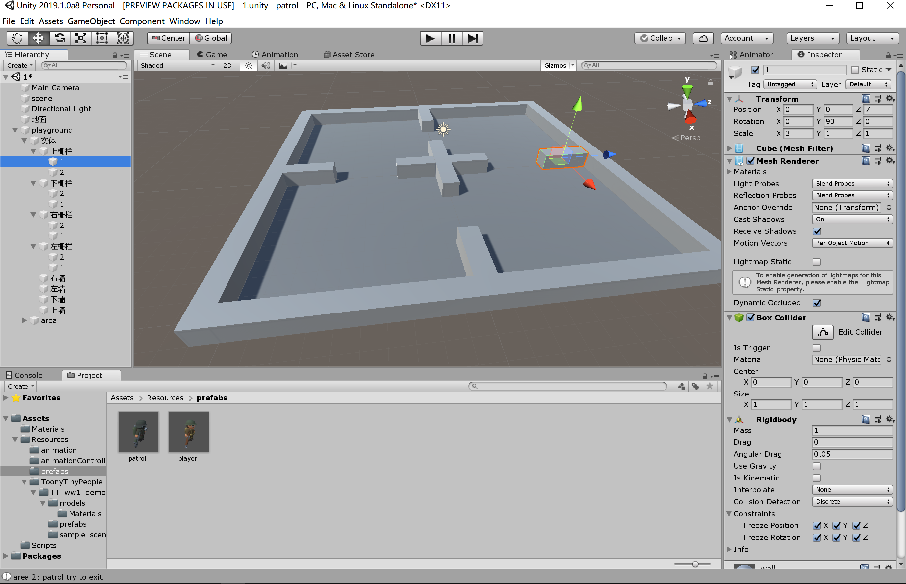
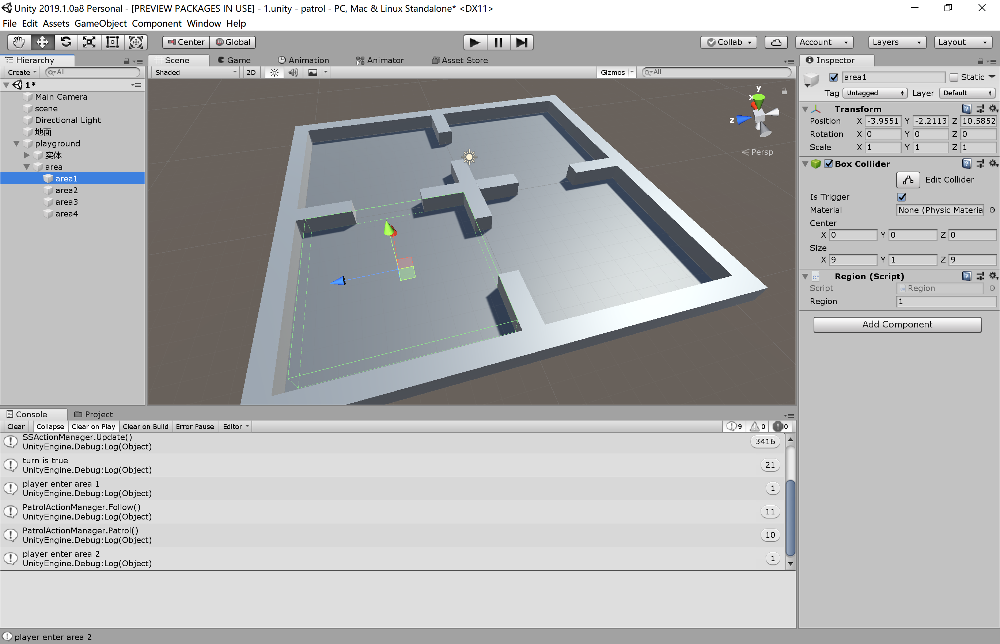
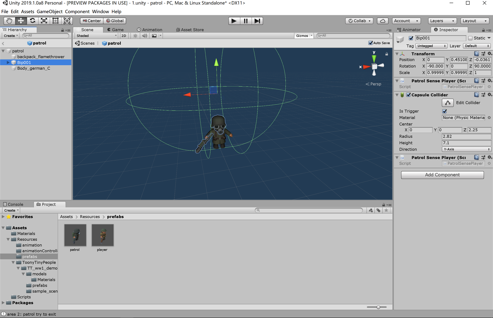
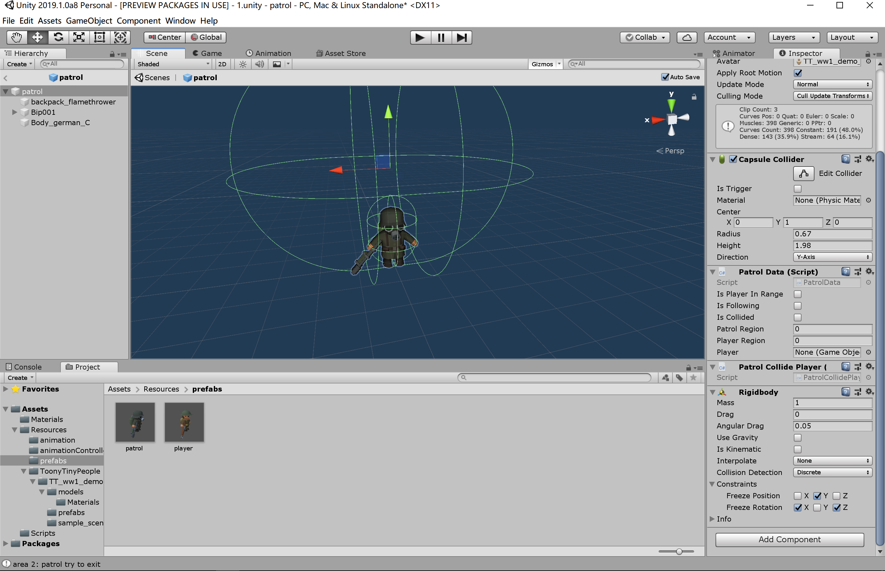
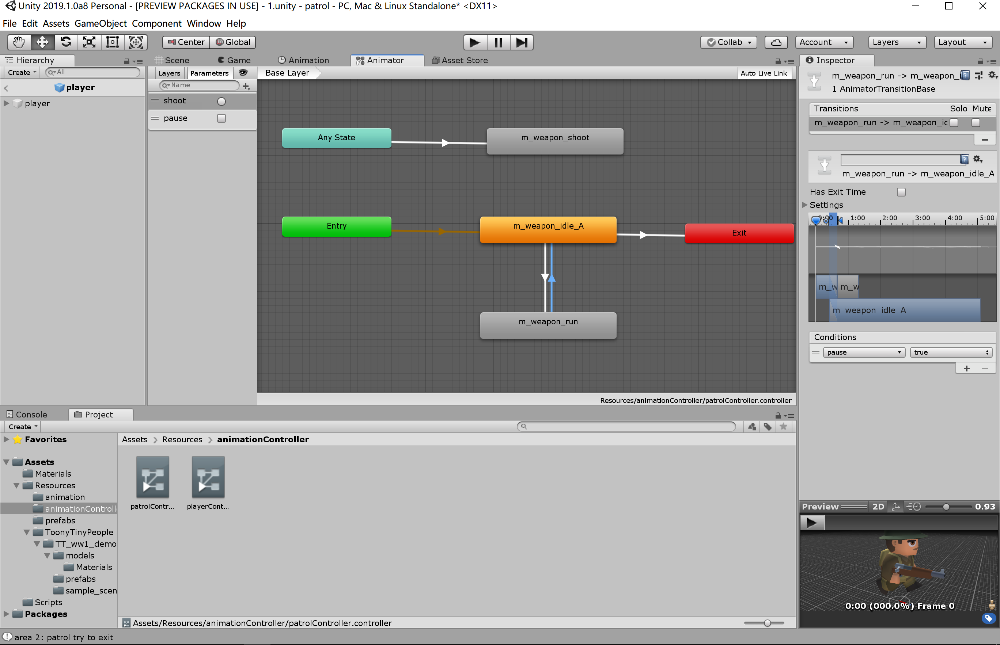
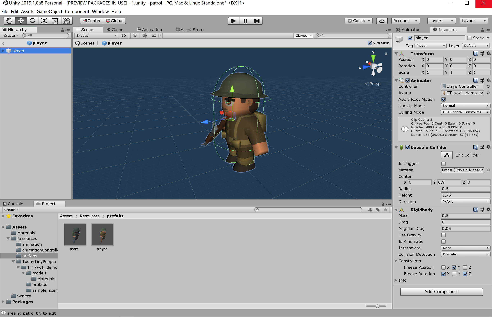
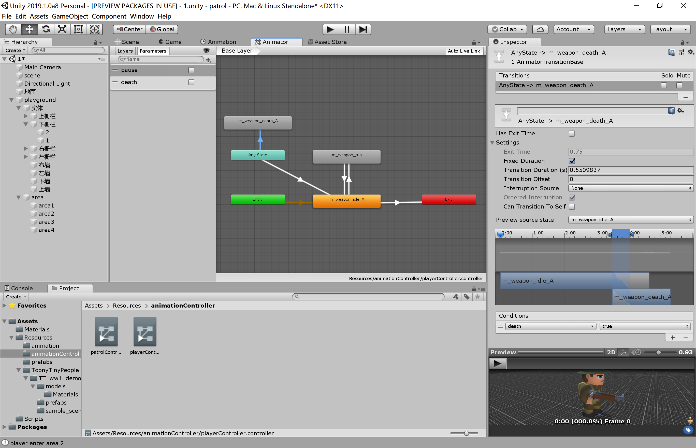

## 智能巡逻兵 - Patrol

### 演示视频

<a href = "https://www.ixigua.com/i6754333622519463949/">视频地址</a>  
(<a href = "https://github.com/guojj33/Unity3DLearning/blob/master/HW7/assets/patrol.mp4" target = "_blank" >备用地址</a>)

### 文件说明

- 代码放在 [Patrol/Assets/Scripts](https://github.com/guojj33/Unity3DLearning/tree/master/HW7/Patrol/Assets/Scripts) 中
- 素材在 [Patrol/Assets/Resources](https://github.com/guojj33/Unity3DLearning/tree/master/HW7/Patrol/Assets/Resources)
- 工程下载到本地后，双击 HitUFO/Assets/1.unity 即可打开工程

### 游戏要求
- 游戏设计要求：
  - 创建一个地图和若干巡逻兵(使用动画)；
  - 每个巡逻兵走一个3~5个边的凸多边型，位置数据是相对地址。即每次确定下一个目标位置，用自己当前位置为原点计算；
  - 巡逻兵碰撞到障碍物，则会自动选下一个点为目标；
  - 巡逻兵在设定范围内感知到玩家，会自动追击玩家；
  - 失去玩家目标后，继续巡逻；
  - 计分：玩家每次甩掉一个巡逻兵计一分，与巡逻兵碰撞游戏结束；
- 程序设计要求：
  - 必须使用订阅与发布模式传消息
  - 工厂模式生产巡逻兵

### 游戏设计

#### 1. 场景和人物
这一步关键在于各个游戏对象的碰撞器、触发器和刚体组件的设置。  
刚体可以挨着碰撞器，但是不能让碰撞器移动，所以，可以给地面添加碰撞器，人物和墙壁添加刚体和碰撞器，这样人物和墙壁都可以站在地面上，人物与墙壁以及人物与人物都可以发生碰撞事件 (OnCollisionEnter)。给每一个区域添加一个触发器，人物进入区域时可以触发碰撞事件 (OnTriggerEnter)。
- 地面  
    具有一个碰撞器  
    
- 墙壁与栅栏  
    每一块物体都有一个碰撞器和刚体。刚体设置禁止位置和旋转属性改变，防止被人物撞飞  
      
    
- 区域  
    一共分为四个区域，每一个区域都有一个触发器  
    
- 巡逻兵  
    在 patrol 的 Bip001 子对象上添加一个触发器，作为感应玩家的视野范围，挂载脚本 PatrolSensePlayer.cs  
    
    在 patrol 上添加碰撞器和刚体组件，挂载脚本 PatrolCollidePlayer.cs，检测巡逻兵与玩家是否相撞。刚体设置禁止 y 方向位置 和 x 方向旋转以及 z 方向旋转改变，可以防止巡逻兵撞到障碍物时摔倒。
    
- 巡逻兵动画控制器  
    使用 shoot 和 pause 两个变量控制。取消勾选 Has Exit Time 可以状态转化时不需要等待动画素材全部播放完。呈现的效果就是，一旦转化条件满足，立即切换动画。
    
- 玩家  
    在 player 上添加碰撞器和刚体。刚体设置和巡逻兵一样
    
- 玩家动画控制器  
    使用 death 和 pause 两个变量控制。同样取消勾选 Has Exit Time，玩家一按方向键，对象立马移动，一松开键盘，对象立即停止。另外在对象死亡的状态转化条件的 Setting 里取消勾选 Can Transition To Self，可以使死亡动画只播放一次，防止出现“要死不死”的状态。
    

#### 2. 关键代码
- 订阅与发布模式  
  - 事件管理器定义事件源  
    ```C#
    //GameEventManager.cs
    public class GameEventManager : MonoBehaviour
    {
        // 玩家逃脱事件
        public delegate void EscapeEvent(GameObject patrol);//定义回调函数类型
        public static event EscapeEvent OnGoalLost;
        // 巡逻兵追击事件
        public delegate void FollowEvent(GameObject patrol);
        public static event FollowEvent OnFollowing;
        // 游戏失败事件
        public delegate void GameOverEvent();
        public static event GameOverEvent GameOver;

        // 玩家逃脱
        public void PlayerEscape(GameObject patrol) {
            if (OnGoalLost != null) {
                OnGoalLost(patrol);
            }
        }

        // 巡逻兵追击
        public void FollowPlayer(GameObject patrol) {
            if (OnFollowing != null) {
                OnFollowing(patrol);
            }
        }

        // 玩家被捕
        public void OnPlayerCatched() {
            if (GameOver != null) {
                GameOver();
            }
        }
    }
    ```

  - 以 Controller 订阅并处理事件为例  
    ```C#
    //Controller.cs
    void OnEnable() 
    {
        // 订阅游戏事件
        GameEventManager.OnGoalLost += OnGoalLost;
        GameEventManager.OnFollowing += OnFollowing;
        GameEventManager.GameOver += GameOver;
    }

    void OnDisable() 
    {
        GameEventManager.OnGoalLost -= OnGoalLost;
        GameEventManager.OnFollowing -= OnFollowing;
        GameEventManager.GameOver -= GameOver;
    }

    public void OnGoalLost(GameObject patrol){
        patrolActionManager.Patrol(patrol);
        scoreRecorder.Record();
    }

    public void OnFollowing(GameObject patrol){
        patrolActionManager.Follow(player, patrol);
    }

    public void GameOver(){
        gameState = GameState.LOSE;
        StopAllCoroutines();
        patrolFactory.PausePatrol();
        player.GetComponent<Animator>().SetTrigger("death");
        patrolActionManager.DestroyAllActions();
    }
    ```

  - 以游戏失败事件为例  
    当巡逻并碰撞到玩家时，调用 ``Singleton<GameEventManager>.Instance.OnPlayerCatched()``发出通知。``OnPlayerCatched()``函数检查是否有订阅者订阅此事件，有则调用订阅者的回调函数。``Controller``作为事件订阅者之一，就调用了自身的``GameOver()``函数。
    ```C#
    //PatrolCollidePlayer.cs
    public class PatrolCollidePlayer : MonoBehaviour {
        void OnCollisionEnter(Collision collision) {
            if (collision.gameObject.tag == "Player") {
                // 当玩家与巡逻兵相撞
                this.GetComponent<Animator>().SetTrigger("shoot");
                Singleton<GameEventManager>.Instance.OnPlayerCatched();
            } else {
                // 当巡逻兵碰到其他障碍物
                this.GetComponent<PatrolData>().isCollided = true;
            }
        }
    }
    ```
- 巡逻兵数据
    ```C#
    public class PatrolData : MonoBehaviour {
        public bool isPlayerInRange;    // 玩家是否在侦测范围里
        public bool isFollowing;        // 是否正在追击
        public bool isCollided;         // 是否发生碰撞
        public int patrolRegion;        // 巡逻兵所在区域
        public int playerRegion;        // 玩家所在区域
        public GameObject player;       // 所追击的玩家
    }
    ```
- 巡逻兵工厂  
    为四个区域各生产一个巡逻兵
    ```C#
    //PatrolFactory.cs
    public class PatrolFactory : MonoBehaviour
    {
        public GameObject patrol = null;
        private List<PatrolData> used = new List<PatrolData>(); // 正在使用的巡逻兵

        public List<GameObject> GetPatrols() {
            List<GameObject> patrols = new List<GameObject>();
            float[] pos_x = {-5f, 5f};
            float[] pos_z = {5f, -5f};
            for (int i = 0; i < 2; i++) {
                for (int j = 0; j < 2; j++) {
                    patrol = Instantiate(Resources.Load<GameObject>("prefabs/patrol"));
                    patrol.transform.position = new Vector3(pos_x[j], 0, pos_z[i]);
                    patrol.GetComponent<PatrolData>().patrolRegion = i * 2 + j + 1;
                    patrol.GetComponent<PatrolData>().playerRegion = 4;
                    patrol.GetComponent<PatrolData>().isPlayerInRange = false;
                    patrol.GetComponent<PatrolData>().isFollowing = false;
                    patrol.GetComponent<PatrolData>().isCollided = false;
                    patrol.GetComponent<Animator>().SetBool("pause", true);
                    used.Add(patrol.GetComponent<PatrolData>());
                    patrols.Add(patrol);
                }
            }
            return patrols;
        }

        public void PausePatrol() {
            //切换所有侦查兵的动画
            for (int i = 0; i < used.Count; i++) {
                used[i].gameObject.GetComponent<Animator>().SetBool("pause", true);
            }
        }

        public void StartPatrol() {
            //切换所有侦查兵的动画
            for (int i = 0; i < used.Count; i++) {
                used[i].gameObject.GetComponent<Animator>().SetBool("pause", false);
            }
        }
    }
    ```
- 巡逻兵感知玩家  
    感知脚本挂载在触发器组件上，触发器方法是 OnTriggerXXX()  
    ```C#
    //PatrolSensePlayer.cs
    public class PatrolSensePlayer : MonoBehaviour
    {
        void OnTriggerEnter(Collider collider) {
            if (collider.gameObject.tag == "Player") {
                // 玩家进入巡逻兵追捕范围
                this.gameObject.transform.parent.GetComponent<PatrolData>().isPlayerInRange = true;
                this.gameObject.transform.parent.GetComponent<PatrolData>().player = collider.gameObject;
            }
        }
        void OnTriggerExit(Collider collider) {
            if (collider.gameObject.tag == "Player") {
                // 玩家离开巡逻兵追捕范围
                this.gameObject.transform.parent.GetComponent<PatrolData>().isPlayerInRange = false;
                this.gameObject.transform.parent.GetComponent<PatrolData>().player = null;
            }
        }
    }
    ```
- 巡逻兵碰撞玩家  
    碰撞脚本挂载在碰撞器组件上，碰撞器方法是 OnCollisionXXX()    
    ```C#
    //PatrolCollidePlayer.cs
    public class PatrolCollidePlayer : MonoBehaviour {
        void OnCollisionEnter(Collision collision) {
            if (collision.gameObject.tag == "Player") {
                // 当玩家与巡逻兵相撞
                this.GetComponent<Animator>().SetTrigger("shoot");
                Singleton<GameEventManager>.Instance.OnPlayerCatched();
            } else {
                // 当巡逻兵碰到其他障碍物
                this.GetComponent<PatrolData>().isCollided = true;
            }
        }
    }
    ```
- 巡逻兵巡逻动作  
    当巡逻兵的 isCollided 属性为真时，可能是撞到墙，也可能是试图离开区域。这时，巡逻兵先向后旋转 180° 再根据当前位置获取下一个随机位置。当到达下一个随机位置，即 distance <= 0.1 条件成立时，继续寻找新方向。除非巡逻兵即将开始进行追逐玩家的动作，巡逻动作不会被销毁。
    ```C#
    //Action.cs
    public class PatrolAction : SSAction
    {
        private float pos_x, pos_z;                 // 移动前的初始x和z方向坐标
        private bool turn = true;                   // 是否选择新方向
        private PatrolData data;                    // 巡逻兵的数据

        public static PatrolAction GetAction(Vector3 location) {
            PatrolAction action = CreateInstance<PatrolAction>();
            action.enable = true;
            action.pos_x = location.x;
            action.pos_z = location.z;
            return action;
        }

        public override void Start() {
            data = this.gameobject.GetComponent<PatrolData>();
        }

        public override void Update() {
            if (SSDirector.getInstance().CurrentSceneController.getGameState().Equals(GameState.RUNNING)) {
                // 巡逻兵巡逻
                Patrol();
                
                if (!data.isFollowing && data.isPlayerInRange && data.patrolRegion == data.playerRegion && !data.isCollided) {
                    this.destroy = true;
                    this.enable = false;
                    this.callback.SSActionEvent(this);
                    this.gameobject.GetComponent<PatrolData>().isFollowing = true;
                    Singleton<GameEventManager>.Instance.FollowPlayer(this.gameobject);
                }
            }
        }

        void Patrol() {
            if (turn) {
                pos_x = this.transform.position.x + Random.Range(-4f, 4f);
                pos_z = this.transform.position.z + Random.Range(-4f, 4f);
                Debug.Log("turn is true");
                this.transform.LookAt(new Vector3(pos_x, 0, pos_z));
                this.gameobject.GetComponent<PatrolData>().isCollided = false;
                turn = false;
            }
            float distance = Vector3.Distance(transform.position, new Vector3(pos_x, 0, pos_z));

            if (this.gameobject.GetComponent<PatrolData>().isCollided) {
                //碰撞，则向后转，寻找新位置
                this.transform.Rotate(Vector3.up, 180);
                GameObject temp = new GameObject();
                temp.transform.position = this.transform.position;
                temp.transform.rotation = this.transform.rotation;
                temp.transform.Translate(0, 0, Random.Range(0.01f, 0.1f));
                pos_x = temp.transform.position.x;
                pos_z = temp.transform.position.z;
                this.transform.LookAt(new Vector3(pos_x, 0, pos_z));
                this.gameobject.GetComponent<PatrolData>().isCollided = false;
                Destroy(temp);
                //turn = true;
            } else if (distance <= 0.1) {
                turn = true;
            } else {
                // 向前移动巡逻兵
                this.transform.Translate(0, 0, Time.deltaTime);
            }
        }
    }
    ```
- 巡逻兵追逐动作  
    追逐玩家时，首先获取玩家的实时位置，然后调用 LookAt 和 MoveTowards 函数实现追逐。
    ```C#
    public class PatrolFollowAction : SSAction
    {
        private float speed = 1.5f;          // 跟随玩家的速度
        private GameObject player;           // 玩家
        private PatrolData data;             // 巡逻兵数据

        public static PatrolFollowAction GetAction(GameObject player) {
            PatrolFollowAction action = CreateInstance<PatrolFollowAction>();
            action.enable = true;
            action.player = player;
            return action;
        }

        public override void Start() {
            data = this.gameobject.GetComponent<PatrolData>();
        }

        public override void Update() {
            if (SSDirector.getInstance().CurrentSceneController.getGameState().Equals(GameState.RUNNING)) {
                // 追击玩家
                transform.position = Vector3.MoveTowards(this.transform.position, player.transform.position, speed * Time.deltaTime);
                this.transform.LookAt(player.transform.position);

                if (data.isFollowing && (!(data.isPlayerInRange && data.patrolRegion == data.playerRegion) || data.isCollided)) {
                    this.destroy = true;
                    this.enable = false;
                    this.callback.SSActionEvent(this);
                    this.gameobject.GetComponent<PatrolData>().isFollowing = false;
                    Singleton<GameEventManager>.Instance.PlayerEscape(this.gameobject);
                }
            }
        }
    }
    ```
- 区域感知对象进出  
    脚本挂载在区域的触发器上，触发器方法都是 OnTriggerXXX()，当玩家进入区域时，更新玩家区域信息；当巡逻兵试图离开区域时，设置其 isCollided 为真，引发动作相关的处理，使巡逻兵调转方向。
    ```C#
    //Region.cs
    public class Region : MonoBehaviour
    {
        public int region;
        Controller sceneController;

        void OnTriggerEnter(Collider collider)
        {
            sceneController = SSDirector.getInstance().CurrentSceneController as Controller;
            if (collider.gameObject.tag == "Player")
            {
                Debug.Log("player enter area " + region);
                sceneController.playerRegion = region;
            }
        }

        void OnTriggerExit(Collider collider)
        {
            if (collider.gameObject.tag == "Patrol")
            {
                Debug.Log("area " + region + ": patrol try to exit");
                collider.gameObject.GetComponent<PatrolData>().isCollided = true;
            }
        }
    }
    ```